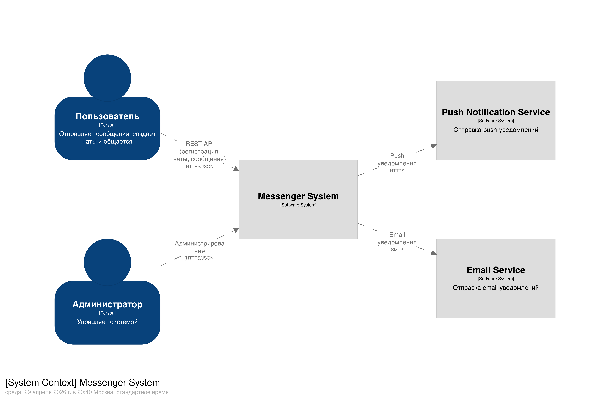

# Домашнее задание 01

## Документирование архитектуры в Structurizr

### Вариант №5 — Мессенджер (https://slack.com/intl/en-gb/)

### Выполнил студент М8О-102СВ-25 Марченко Алексей Эдуардович

---

# 1. Описание выбранного варианта

Разрабатывается система мессенджера, позволяющая пользователям общаться в реальном времени, создавать чаты и обмениваться сообщениями.

Система должна обеспечивать:

- регистрацию и поиск пользователей;
- создание групповых чатов;
- обмен сообщениями в групповых чатах;
- обмен личными (PtP) сообщениями;
- загрузку истории сообщений;
- отправку уведомлений;
- поддержку realtime взаимодействия (WebSocket).

Система предназначена для общения пользователей в рамках единой платформы.

---

# 2. Роли пользователей и внешние системы

## Роли пользователей

### 1. Пользователь

Основной пользователь системы.

Возможности:

- регистрация и авторизация;
- поиск других пользователей;
- создание групповых чатов;
- добавление пользователей в чат;
- отправка сообщений;
- получение сообщений в реальном времени;
- просмотр истории сообщений;
- получение уведомлений.

---

### 2. Администратор

Пользователь с расширенными правами.

Функции:

- управление системой;
- контроль пользователей;
- мониторинг работы системы.

---

## Внешние системы

### 1. Push Notification Service

Используется для:

- отправки push-уведомлений пользователям;
- информирования о новых сообщениях.

---

### 2. Email Service

Используется для:

- отправки email-уведомлений;
- уведомлений о событиях в системе.

---

# 3. Диаграмма System Context (C1)

На уровне System Context мессенджер рассматривается как единая система, взаимодействующая с пользователями и внешними сервисами.

Взаимодействия:

- Пользователь и Администратор взаимодействуют с системой через API Gateway.
- Система отправляет push-уведомления через Push Notification Service.
- Система отправляет email-уведомления через Email Service.

Система выступает центральной платформой обмена сообщениями.

---

# 4. Основные Use Cases

## Для пользователя

- регистрация и авторизация;
- поиск пользователя по логину;
- поиск пользователя по имени и фамилии;
- создание группового чата;
- добавление пользователя в чат;
- отправка сообщения в чат;
- отправка личного (PtP) сообщения;
- получение сообщений;
- просмотр истории сообщений;
- получение уведомлений.

---

## Для администратора

- управление пользователями;
- мониторинг активности;
- управление системой.

---

# 5. Контейнерная архитектура (C2)

Система реализована с использованием микросервисной архитектуры.

---

## Инфраструктурный слой

### API Gateway (Nginx + WebSocket)

Основные функции:

- маршрутизация запросов;
- SSL termination;
- аутентификация;
- поддержка WebSocket соединений для realtime обмена сообщениями.

---

## Основные сервисы

### User Service

Отвечает за:

- регистрацию пользователей;
- поиск пользователей;
- управление профилями.

---

### Chat Service

Отвечает за:

- создание и управление чатами;
- добавление пользователей в чат;
- управление участниками.

---

### Message Service

Отвечает за:

- отправку сообщений;
- получение сообщений;
- хранение истории сообщений;
- обработку realtime сообщений.

---

### Notification Service

Отвечает за:

- генерацию уведомлений;
- отправку уведомлений через внешние сервисы.

---

## Хранилища данных

### User Database (PostgreSQL)

Хранит:

- данные пользователей.

---

### Chat Database (PostgreSQL)

Хранит:

- информацию о чатах;
- участников чатов.

---

### Message Database (PostgreSQL)

Хранит:

- сообщения;
- историю переписки.

---

## Кэширование

### Cache (Redis)

Используется для:

- кэширования пользователей;
- кэширования сообщений;
- ускорения доступа к данным.

---

## Брокер сообщений

### Message Broker (Kafka / RabbitMQ)

Используется для:

- асинхронной обработки сообщений;
- доставки событий между сервисами;
- отправки уведомлений.

---

# 6. Взаимодействие контейнеров

## Синхронные взаимодействия

Основные взаимодействия происходят через HTTP/JSON:

- Gateway → User Service (регистрация, поиск)
- Gateway → Chat Service (управление чатами)
- Gateway → Message Service (отправка сообщений)
- Chat Service → User Service (проверка пользователей)
- Message Service → Chat Service (проверка чата)

---

## Асинхронные взаимодействия

Используется брокер сообщений:

1. Message Service публикует событие нового сообщения.
2. Message Broker передает событие:
   - в Notification Service;
   - обратно в Message Service (для доставки получателю).
3. Notification Service отправляет уведомления через внешние сервисы.

---

# 7. Dynamic диаграмма (архитектурно значимый сценарий)

## Сценарий: Отправка сообщения

Последовательность работы системы:

1. Пользователь отправляет сообщение через WebSocket (Gateway).
2. Gateway передает сообщение в Message Service.
3. Message Service проверяет чат через Chat Service.
4. Chat Service проверяет участников через User Service.
5. Message Service сохраняет сообщение в Message Database.
6. Message Service обновляет кэш.
7. Message Service публикует событие в Message Broker.
8. Message Broker:
   - уведомляет Message Service для доставки сообщения получателю;
   - уведомляет Notification Service.
9. Message Service отправляет сообщение получателю через WebSocket.
10. Notification Service отправляет push-уведомление.
11. Notification Service отправляет email-уведомление.
12. Message Service отправляет ACK (подтверждение) отправителю.

Сценарий является архитектурно значимым, так как:

- затрагивает все ключевые сервисы;
- включает синхронные и асинхронные взаимодействия;
- демонстрирует realtime обмен сообщениями;
- включает обработку уведомлений.

---

# 8. Выбор технологий

| Компонент        | Технология        |
| ---------------- | ----------------- |
| API Gateway      | Nginx + WebSocket |
| Backend сервисы  | C++ / Userver     |
| Базы данных      | PostgreSQL        |
| Кэш              | Redis             |
| Брокер сообщений | Kafka / RabbitMQ  |
| Email            | SMTP              |
| API              | HTTPS / JSON      |
| Realtime         | WebSocket (WSS)   |

---

# 9. Результат работы в картинках

